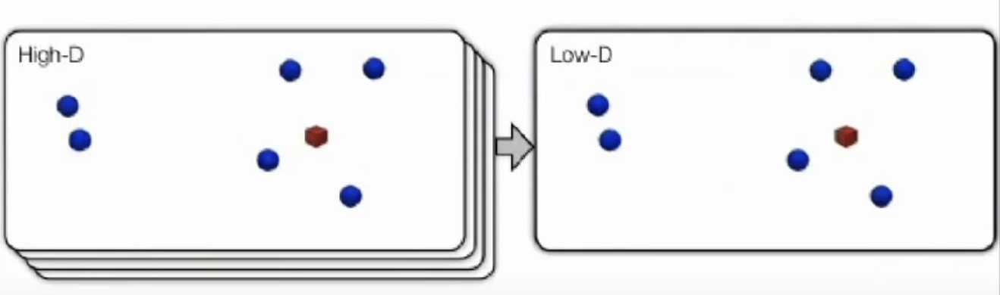

# Visualizing Data Using t-SNE

> t-distributed stochastic neighbor embedding (t-SNE) is a statistical method for visualizing high-dimensional data by giving each datapoint a location in a two or three-dimensional map. It is based on Stochastic Neighbor Embedding, and its name is due to being t-distributed variant. It is a nonlinear dimensionality reduction technique for embedding high-dimensional data for visualization in a low-dimensional space of two or three dimensions. Specifically, it models each high-dimensional object by a 2D or 3D point in such a way that similar objects are modeled by nearby points and dissimilar objects are modeled by distant points with high probability.

## Course link
Click [URL: Visualizing Data Using t-SNE](https://www.youtube.com/watch?v=RJVL80Gg3lA)

## Introduction

* We are given a collection of $N$ of high-dimensional object $\boldsymbol{x_1, ..., x_N}$
* How can we get a feel for how these objects are arranged in data space.
* The information visualization field has developed many methods for data visualization. These methods only represent a few variables at a time:
  *  parallel coordinates
  *  radial graph layouts
  *  tree maps
  *  world maps
*  Now the question is: How to visualize high-dimensional data?
  *  Simple idea: build a map (distance between points reflect similarifies in the data): Similar objects are going to be represented by nearby points. + Dissimilar objects are going to be represented by distant points.
  *  Then embed those points in some low dimensional map (e.g. 2D, 3D) -> can be embeded in 2D, 3D maps.
  *  Allow representation by scatter plot.

